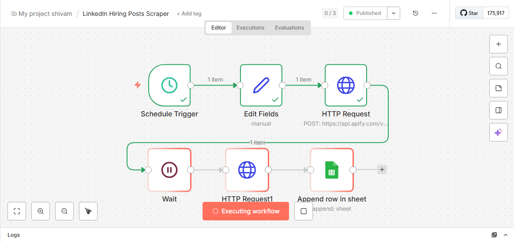

# LinkedIn Hiring Posts Automation Setup (Feb 2026)

## Visual Overview – n8n Workflow Console

> **Paste your screenshot here**  
> Save your screenshot as **`n8n-console-screenshot.png`** in the same folder as this README.md  
> The image will automatically appear when viewed on GitHub, Notion, Obsidian, or any Markdown viewer.

---

## Overview
This is a complete **end-to-end automation** that scrapes recent LinkedIn hiring posts daily/weekly and stores them in Google Sheets in two layers:
- **Raw data** → directly from Apify (via n8n)
- **Cleaned & enriched data** → processed by Python (ready for email outreach)

**Goal**: Zero manual searching on LinkedIn. All #hiring posts (Data Analyst, Data Engineer, Power BI, etc.) land in one clean Google Sheet every week.

---

## How the Automation Works (Step-by-Step)

1. **n8n Workflow** runs automatically every week
2. Triggers **Apify LinkedIn Post Search** actor with targeted hashtags
3. Waits for the scrape to finish
4. Dumps **raw posts** into Google Sheet tab → **Sheet1**
5. **Python Jupyter Notebook** reads Sheet1
6. Cleans & enriches the data (extracts emails, author details, readable timestamps)
7. Writes the final clean version into Google Sheet tab → **LinkedIn Posts Data**

---

## Files Included

### 1. `LinkedIn Hiring Posts Scraper.json`
- **Type**: n8n workflow export (ready to import)
- **Purpose**: Full scraping pipeline
- **Key Components**:
  - Schedule Trigger: Runs every **Wednesday at 12:00**
  - Search query: `#hiring (#data analyst OR #dataengineer OR #PowerbiHiring)` + `maxPosts = 150`
  - Apify actor + 60-second wait + Google Sheets append

### 2. `LinkedIn Hiring Posts - Feb 2026(n8n Automation).ipynb`
- **Type**: Jupyter Notebook (Python 3)
- **Purpose**: Cleans raw data and updates the final sheet
- Extracts emails, author info, readable timestamps, etc.

---

## Final Output in Google Sheets

**Tab: LinkedIn Posts Data** (clean & ready for outreach):
- `post_url`
- `post_content`
- `extracted_emails`
- `author_name`
- `author_info`
- `author_linkedin`
- `Posted_Time`

---

## How to Set Up (5 Minutes)

1. Import the `.json` file into n8n → Activate
2. Make sure your Google Sheet has tabs: `Sheet1` and `LinkedIn Posts Data`
3. Place `credentials.json` in the correct path
4. Run once → then run the notebook (or schedule it)

---
